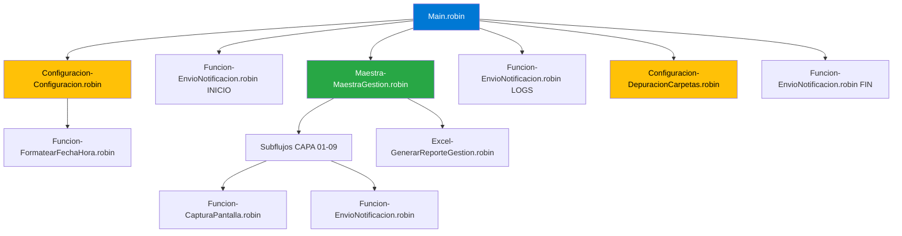
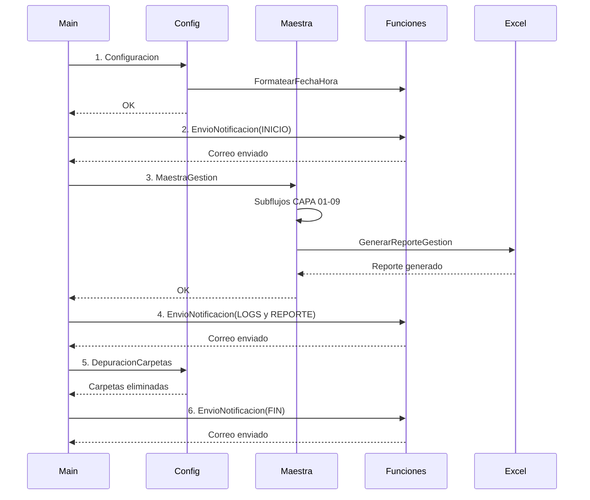
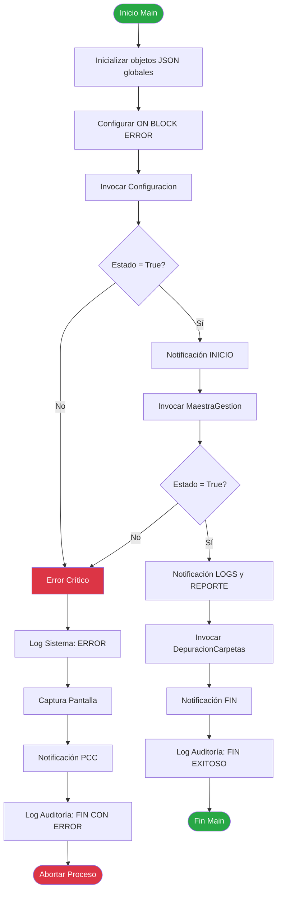
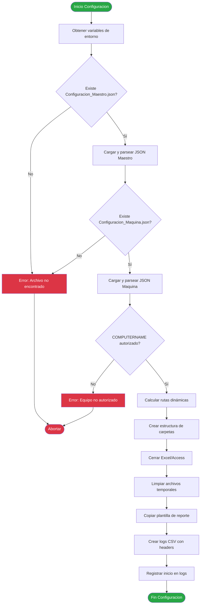
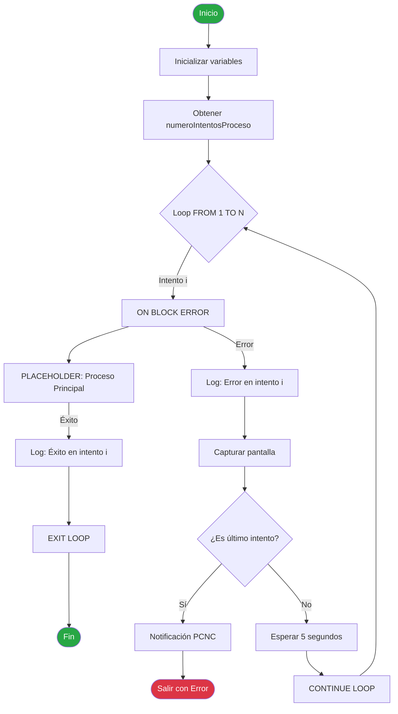
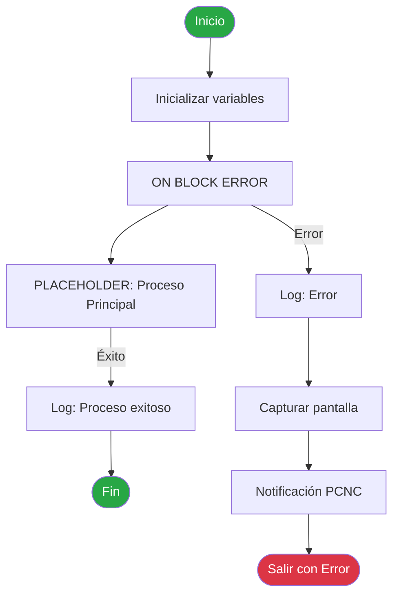
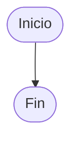

# Manual Técnico - Flujos Power Automate Desktop
## RDA Costo Amortizable

**Versión**: 1.0  
**Fecha**: 2025-12-12  
**Autor**: Ronald Estiven Rios Hernandez  
**Organización**: Banco Caja Social - Coordinación de Portafolio

---

## 📑 Índice

1. [Introducción](#1-introducción)
2. [Arquitectura de Flujos](#2-arquitectura-de-flujos)
3. [Flujos Documentados](#3-flujos-documentados)
   - 3.1 [Main.robin](#31-mainrobin)
   - 3.2 [[Configuracion]-Configuracion.robin](#32-configuracion-configuracionrobin)
   - 3.3 [[Configuracion]-DepuracionCarpetas.robin](#33-configuracion-depuracioncarpetasrobin)
   - 3.4 [[Maestra]-MaestraGestion.robin](#34-maestra-maestragestionrobin)
   - 3.5 [[Funcion]-CapturaPantalla.robin](#35-funcion-capturapantallarobin)
   - 3.6 [[Funcion]-EnvioNotificacion.robin](#36-funcion-envionotificacionrobin)
   - 3.7 [[Funcion]-FormatearFechaHora.robin](#37-funcion-formatearfechahorarobin)
   - 3.8 [[Excel]-GenerarReporteGestion.robin](#38-excel-generarreportegestionrobin)
   - 3.9 [Plantilla_Con_Reintento.robin](#39-plantilla_con_reintentorobin)
   - 3.10 [Plantilla_Sin_Reintento.robin](#310-plantilla_sin_reintentorobin)
4. [Variables Globales Compartidas](#4-variables-globales-compartidas)
5. [Convenciones de Desarrollo](#5-convenciones-de-desarrollo)
6. [Anexos](#6-anexos)

---

## 1. Introducción

### 1.1 Propósito del Manual

Este manual técnico documenta los flujos base de Power Automate Desktop (PAD) del RDA Costo Amortizable. Está dirigido a desarrolladores RPA, arquitectos de solución y personal técnico que necesite:

- Entender la arquitectura y diseño de los flujos PAD
- Mantener y evolucionar los flujos existentes
- Desarrollar nuevos subflujos siguiendo los estándares establecidos
- Diagnosticar y resolver problemas de ejecución

### 1.2 Alcance

El manual cubre:

✅ **10 flujos base** (1 orquestador, 2 de configuración, 1 maestra, 4 funciones, 1 helper Excel, 2 plantillas)  
✅ **Variables globales** compartidas entre todos los flujos  
✅ **Convenciones de desarrollo** (nomenclatura, estructura, logs)  
✅ **Diagramas de flujo** en formato Mermaid  
✅ **Casos de prueba** por cada flujo  
✅ **Manejo de errores** PCC y PCNC

### 1.3 Audiencia

- **Desarrolladores RPA**: Para desarrollo y mantenimiento de flujos
- **Arquitectos de Solución**: Para diseño de nuevos componentes
- **Especialistas de Soporte**: Para diagnóstico de errores
- **Usuarios Funcionales**: Para comprensión general del proceso

---

## 2. Arquitectura de Flujos

### 2.1 Organización por Capas

Los flujos PAD están organizados en una arquitectura de capas que facilita el mantenimiento y la escalabilidad:

```
RDA_Costo_Amortizable/
│
├── Main.robin                          # ORQUESTADOR
│   └── Coordina la ejecución completa del RDA
│
├── subprocesos/
│   ├── 00_Configuracion/               # CAPA 00: Configuración
│   │   ├── [Configuracion]-Configuracion.robin
│   │   └── [Configuracion]-DepuracionCarpetas.robin
│   │
│   ├── 10_Maestra/                     # CAPA 10: Maestra
│   │   └── [Maestra]-MaestraGestion.robin
│   │
│   ├── 99_Funciones/                   # CAPA 99: Funciones Utilitarias
│   │   ├── [Funcion]-CapturaPantalla.robin
│   │   ├── [Funcion]-EnvioNotificacion.robin
│   │   └── [Funcion]-FormatearFechaHora.robin
│   │
│   └── Excel/                          # HELPERS: Excel
│       └── [Excel]-GenerarReporteGestion.robin
│
└── plantillas/                         # TEMPLATES
    ├── Plantilla_Con_Reintento.robin
    └── Plantilla_Sin_Reintento.robin
```

### 2.2 Capas Funcionales

| Capa | Nombre | Propósito | Ejemplos |
|------|--------|-----------|----------|
| **00** | Configuración | Inicialización y limpieza de entorno | Carga JSON, creación de carpetas, depuración |
| **01-09** | Procesamiento de Negocio | Lógica funcional específica del proceso | Extracción, consolidación, validación, cálculos |
| **10** | Maestra | Coordinación de subflujos de negocio | Invocación secuencial de subflujos CAPA 01-09 |
| **99** | Funciones Utilitarias | Servicios transversales reutilizables | Capturas, notificaciones, formateo |
| **Excel** | Helpers Excel | Operaciones específicas de Excel | Generación de reportes, lectura/escritura |
| **Plantillas** | Templates | Plantillas para nuevos desarrollos | Templates con/sin reintentos |

### 2.3 Diagrama de Invocación



### 2.4 Flujo de Ejecución Completo



---

## 3. Flujos Documentados

### 3.1 Main.robin

#### Descripción

Flujo orquestador principal del RDA Costo Amortizable. Coordina la ejecución completa del proceso automatizado, invocando los subflujos en secuencia y manejando errores críticos a nivel global.

#### Arquitectura

- **Capa**: Orquestación
- **Rol**: Coordinador central del proceso
- **Tipo**: Flujo principal (entry point)
- **Ubicación**: `workflows/power-automate/Main.robin`

#### Entrada/Salida

| Tipo | Variable | Descripción | Tipo de Dato | Obligatorio |
|------|----------|-------------|--------------|-------------|
| **Entrada** | N/A | No recibe parámetros de entrada | N/A | N/A |
| **Salida** | gblObjVariablesGenerales | Objeto global con estado del proceso | CustomObject (JSON) | Sí |
| **Salida** | gblStrRutaLogAuditoria | Ruta del log de auditoría generado | String | Sí |
| **Salida** | gblStrRutaLogSistema | Ruta del log de sistema generado | String | Sí |

#### Flujo de Trabajo

1. **Inicialización de objetos JSON globales**
   - Crear `gblObjVariablesGenerales` con estructura base
   - Crear `gblObjFormatoFechaHora` con formatos de fecha/hora
   - Crear `gblObjReporteGestion` vacío
   - Inicializar `listaRutasCapturasPantalla` vacía

2. **Configurar control de errores global (ON BLOCK ERROR)**
   - Registrar error en log de sistema
   - Capturar pantalla del error (tipo "Error")
   - Enviar notificación PCC (Proceso Con Control - crítico)
   - Registrar en log de auditoría "FIN PROCESO CON ERROR CRÍTICO"
   - Lanzar excepción para abortar proceso

3. **Invocar [Configuracion]-Configuracion**
   - Establecer `gblObjVariablesGenerales.subflujo = "Configuracion"`
   - Llamar subflujo de configuración inicial
   - Validar `estadoProceso = "True"`
   - Si falla, lanzar excepción

4. **Enviar notificación de INICIO**
   - Formatear fecha/hora actual
   - Establecer `tipoNotificacion = "INICIO"`
   - Invocar [Funcion]-EnvioNotificacion

5. **Invocar [Maestra]-MaestraGestion**
   - Establecer `subflujo = "MaestraGestion"`
   - Llamar maestra que coordina subflujos CAPA 01-09
   - Validar éxito del procesamiento de negocio

6. **Enviar notificación con LOGS y REPORTE**
   - Establecer `tipoNotificacion = "LOGS y REPORTE"`
   - Adjuntar logs de auditoría, sistema y reporte de gestión

7. **Invocar [Configuracion]-DepuracionCarpetas**
   - Establecer `subflujo = "DepuracionCarpetas"`
   - Ejecutar limpieza mensual de carpetas antiguas

8. **Enviar notificación de FIN exitoso**
   - Formatear fecha/hora final
   - Establecer `tipoNotificacion = "FIN"`
   - Registrar en log de auditoría "FIN PROCESO EXITOSO"

#### Diagrama de Flujo



#### Manejo de Errores

| Tipo de Error | Código | Acción | Impacto | Notificación |
|---------------|--------|--------|---------|--------------|
| Error en Configuracion | PCC-001 | Abortar proceso, notificar | CRÍTICO - Detiene ejecución | PCC |
| Error en MaestraGestion | PCC-002 | Abortar proceso, notificar | CRÍTICO - Detiene ejecución | PCC |
| Error global no controlado | PCC-999 | Captura pantalla, abortar | CRÍTICO - Detiene ejecución | PCC |

#### Casos de Prueba

| # | Escenario | Entrada | Resultado Esperado | Estado |
|---|-----------|---------|-------------------|--------|
| TC-001 | Ejecución exitosa completa | Configuración válida | Proceso completo sin errores, notificación FIN | ✅ |
| TC-002 | Error en configuración inicial | Archivo JSON faltante | Error PCC-001, notificación PCC | ✅ |
| TC-003 | Error en maestra de gestión | Subflujo CAPA 01 falla | Error PCC-002, notificación PCC | ✅ |
| TC-004 | Día no hábil | Ejecución en festivo | Notificación DIANOHABIL, salida limpia | ✅ |
| TC-005 | Envío de logs y reporte | Ejecución exitosa | Email con 3 adjuntos (logs + reporte) | ✅ |

#### Dependencias

**Invoca:**
- `[Configuracion]-Configuracion.robin`
- `[Funcion]-FormatearFechaHora.robin`
- `[Funcion]-EnvioNotificacion.robin`
- `[Funcion]-CapturaPantalla.robin`
- `[Maestra]-MaestraGestion.robin`
- `[Configuracion]-DepuracionCarpetas.robin`

**Variables globales:**
- `gblObjVariablesGenerales`
- `gblObjFormatoFechaHora`
- `gblObjReporteGestion`
- `gblStrNumeroUnicoProceso`
- `listaRutasCapturasPantalla`

**Archivos:**
- `Configuracion_Maestro.json` (lectura)
- `Configuracion_Maquina.json` (lectura)
- `Log_Auditoria_YYYYMMDD.csv` (escritura)
- `Log_Sistema_YYYYMMDD.csv` (escritura)

#### Notas Técnicas

- El Main.robin es el único flujo que debe ejecutarse directamente. Todos los demás son subflujos.
- El control de errores global (ON BLOCK ERROR) captura cualquier error no manejado en subflujos.
- La secuencia de invocación NO debe alterarse, ya que existe dependencia entre los subflujos.
- Las notificaciones de INICIO y FIN son obligatorias para auditoría.
- La depuración de carpetas se ejecuta siempre, pero solo elimina si se cumple la fecha parametrizada.

---

### 3.2 [Configuracion]-Configuracion.robin

#### Descripción

Flujo de configuración inicial del RDA. Carga archivos JSON de configuración (Maestro y Máquina), valida el equipo de ejecución, crea estructura de carpetas dinámicas, cierra aplicaciones previas, y prepara el entorno para la ejecución del proceso.

#### Arquitectura

- **Capa**: 00 - Configuración
- **Rol**: Inicializador del entorno de ejecución
- **Tipo**: Subflujo de configuración
- **Ubicación**: `workflows/power-automate/subprocesos/00_Configuracion/[Configuracion]-Configuracion.robin`

#### Entrada/Salida

| Tipo | Variable | Descripción | Tipo de Dato | Obligatorio |
|------|----------|-------------|--------------|-------------|
| **Entrada** | N/A | No recibe parámetros | N/A | N/A |
| **Salida** | gblObjConfigMaestro | Objeto con configuración maestro | CustomObject (JSON) | Sí |
| **Salida** | gblObjConfigMaquina | Objeto con configuración de máquina | CustomObject (JSON) | Sí |
| **Salida** | gblStrRutaBase | Ruta base del proceso (con año/mes) | String | Sí |
| **Salida** | gblStrRutaCapturas | Ruta de capturas de pantalla | String | Sí |
| **Salida** | gblStrRutaLogs | Ruta de logs (auditoría y sistema) | String | Sí |
| **Salida** | gblStrRutaReportes | Ruta de reportes generados | String | Sí |
| **Salida** | gblStrRutaTemp | Ruta de archivos temporales | String | Sí |

#### Flujo de Trabajo

1. **Definir rutas base**
   - Obtener `USERPROFILE` y `COMPUTERNAME` de variables de entorno
   - Construir rutas de archivos JSON de configuración

2. **Cargar Configuracion_Maestro.json**
   - Validar existencia del archivo
   - Leer contenido como texto UTF-8
   - Parsear JSON a objeto `gblObjConfigMaestro`

3. **Cargar Configuracion_Maquina.json**
   - Validar existencia del archivo
   - Leer contenido como texto UTF-8
   - Parsear JSON a objeto `gblObjConfigMaquina`

4. **Validar COMPUTERNAME**
   - Iterar sobre `gblObjConfigMaestro.maquinasAutorizadas`
   - Comparar `COMPUTERNAME` con lista autorizada
   - Si no está autorizado, lanzar error

5. **Calcular rutas dinámicas**
   - Obtener fecha actual (año, mes, día)
   - Construir `gblStrRutaBase` con patrón: `{rutaBase}/{año}/{mes}`
   - Derivar rutas de capturas, logs, reportes, temp

6. **Crear estructura de carpetas**
   - Ejecutar script VBS para crear carpetas recursivamente
   - Carpetas: Capturas, Logs, Reportes, Temp

7. **Cerrar aplicaciones previas**
   - Ejecutar script VBS para terminar procesos Excel y Access
   - Esperar 2 segundos para asegurar cierre

8. **Limpiar archivos temporales**
   - Si existe carpeta Temp, obtener lista de archivos
   - Eliminar todos los archivos encontrados

9. **Copiar plantilla de reporte**
   - Validar existencia de plantilla
   - Copiar a carpeta de reportes con nomenclatura YYYYMMDD

10. **Crear logs CSV con headers**
    - Si no existe Log_Auditoria, crear con headers
    - Si no existe Log_Sistema, crear con headers

11. **Registrar inicio en logs**
    - Formatear fecha/hora actual
    - Escribir línea en log de auditoría: "INICIO CONFIGURACION"
    - Escribir línea en log de sistema: "INFO,Configuracion,Completada"

#### Diagrama de Flujo



#### Manejo de Errores

| Tipo de Error | Código | Acción | Impacto | Notificación |
|---------------|--------|--------|---------|--------------|
| Archivo JSON faltante | CFG-001 | Abortar, marcar estadoProceso=False | CRÍTICO | PCC (vía Main) |
| Equipo no autorizado | CFG-002 | Abortar, marcar estadoProceso=False | CRÍTICO | PCC (vía Main) |
| Error al crear carpetas | CFG-003 | Abortar, marcar estadoProceso=False | CRÍTICO | PCC (vía Main) |
| Error al copiar plantilla | CFG-004 | Registrar advertencia, continuar | BAJO | Log Sistema |

#### Casos de Prueba

| # | Escenario | Entrada | Resultado Esperado | Estado |
|---|-----------|---------|-------------------|--------|
| TC-CFG-001 | Configuración exitosa | JSONs válidos, equipo autorizado | Carpetas creadas, logs inicializados | ✅ |
| TC-CFG-002 | Archivo Maestro faltante | Sin Configuracion_Maestro.json | Error CFG-001, estadoProceso=False | ✅ |
| TC-CFG-003 | Equipo no autorizado | COMPUTERNAME no en lista | Error CFG-002, estadoProceso=False | ✅ |
| TC-CFG-004 | Plantilla de reporte faltante | Sin plantilla | Advertencia en log, continúa | ✅ |
| TC-CFG-005 | Archivos temporales existentes | Carpeta Temp con archivos | Archivos eliminados correctamente | ✅ |

#### Dependencias

**Invoca:**
- `[Funcion]-FormatearFechaHora.robin`

**Variables globales (establece):**
- `gblObjConfigMaestro`
- `gblObjConfigMaquina`
- `gblStrRutaBase`
- `gblStrRutaCapturas`
- `gblStrRutaLogs`
- `gblStrRutaReportes`
- `gblStrRutaTemp`
- `gblStrRutaLogAuditoria`
- `gblStrRutaLogSistema`
- `gblStrRutaReporteGestion`

**Archivos (lectura):**
- `Configuracion_Maestro.json`
- `Configuracion_Maquina.json`
- `Plantilla_Reporte_Gestion.xlsx`

**Archivos (escritura):**
- `Log_Auditoria_YYYYMMDD.csv`
- `Log_Sistema_YYYYMMDD.csv`
- `Reporte_Gestion_YYYYMMDD.xlsx`

#### Notas Técnicas

- Este flujo DEBE ejecutarse antes que cualquier otro subflujo, ya que inicializa variables globales críticas.
- La validación de COMPUTERNAME es una medida de seguridad para prevenir ejecución en equipos no autorizados.
- Las rutas son dinámicas (incluyen año/mes/día) para facilitar la organización temporal de archivos.
- El cierre de Excel/Access es preventivo para evitar conflictos de acceso a archivos.
- La limpieza de archivos temporales evita residuos de ejecuciones previas fallidas.
- Si la plantilla de reporte no existe, se registra advertencia pero el proceso continúa.

---


### 3.3 [Configuracion]-DepuracionCarpetas.robin

#### Descripción

Flujo de limpieza mensual automatizada de carpetas antiguas. Elimina carpetas del mes anterior en una fecha parametrizada (por defecto día 5) para mantener el sistema organizado y liberar espacio en disco.

#### Arquitectura

- **Capa**: 00 - Configuración
- **Rol**: Mantenimiento del sistema de archivos
- **Tipo**: Subflujo de limpieza (PCNC - No crítico)
- **Ubicación**: `workflows/power-automate/subprocesos/00_Configuracion/[Configuracion]-DepuracionCarpetas.robin`

#### Entrada/Salida

| Tipo | Variable | Descripción | Tipo de Dato | Obligatorio |
|------|----------|-------------|--------------|-------------|
| **Entrada** | gblObjConfigMaestro.diaEliminacionCarpetas | Día del mes para ejecutar eliminación | Integer | Sí |
| **Entrada** | gblObjConfigMaquina.rutaBase | Ruta base del sistema | String | Sí |
| **Salida** | gblObjVariablesGenerales.estadoProceso | Estado de la depuración | Boolean (String) | Sí |
| **Salida** | gblObjVariablesGenerales.observaciones | Observaciones del proceso | String | Sí |

#### Flujo de Trabajo

1. **Inicializar diccionario de meses** - Crear diccionario para calcular mes anterior (01→12, 02→01, etc.)
2. **Capturar fecha actual** - Obtener día, mes y año actual del sistema
3. **Validar día de eliminación** - Comparar día actual con parámetro `diaEliminacionCarpetas`
4. **Calcular mes/año a eliminar** - Restar 1 mes, considerando cambio de año en enero
5. **Construir lista de carpetas** - 6 rutas: Capturas, Logs, Reportes, Temp, Procesados, Base
6. **Eliminar carpetas** - Iterar lista, validar existencia, eliminar recursivamente
7. **Registrar logs** - Log detallado de cada operación y resumen final

#### Casos de Prueba

| # | Escenario | Entrada | Resultado Esperado | Estado |
|---|-----------|---------|-------------------|--------|
| TC-DEP-001 | Día válido para eliminación | Día 5, carpetas existen | Carpetas eliminadas, contador=6 | ✅ |
| TC-DEP-002 | Día no válido | Día 3 (< día parametrizado) | Salida sin eliminación | ✅ |
| TC-DEP-003 | Mes enero (cambio de año) | Mes=01, Año=2025 | Eliminar Mes=12, Año=2024 | ✅ |
| TC-DEP-004 | Carpetas no existen | Sin carpetas del mes anterior | Log: "Carpeta no existe", contador=0 | ✅ |

#### Notas Técnicas

- **Error PCNC**: Los errores en este flujo no detienen el proceso principal.
- **Cambio de año**: Lógica especial para enero (mes anterior es diciembre del año previo).
- **Rollover seguro**: Si el día actual es menor al parametrizado, no se ejecuta eliminación.

---

### 3.4 [Maestra]-MaestraGestion.robin

#### Descripción

Flujo gestor de subflujos de negocio (CAPA 01-09). Coordina la ejecución secuencial de todos los subflujos de procesamiento funcional del RDA, valida días hábiles, y genera el reporte de gestión consolidado.

#### Arquitectura

- **Capa**: 10 - Maestra
- **Rol**: Orquestador de subflujos de negocio
- **Tipo**: Subflujo coordinador
- **Ubicación**: `workflows/power-automate/subprocesos/10_Maestra/[Maestra]-MaestraGestion.robin`

#### Entrada/Salida

| Tipo | Variable | Descripción | Tipo de Dato | Obligatorio |
|------|----------|-------------|--------------|-------------|
| **Entrada** | N/A | No recibe parámetros | N/A | N/A |
| **Salida** | gblObjVariablesGenerales.estadoProceso | Estado del procesamiento | Boolean (String) | Sí |
| **Salida** | gblStrNumeroUnicoProceso | ID único del proceso (reseteado) | String | Sí |

#### Flujo de Trabajo

1. **Validar día hábil** - Llamar `[Funcion]-LaFechaEsUnDiaNoHabil`
2. **Validar resultado** - Si es día no hábil, enviar notificación y salir
3. **Invocar subflujos CAPA 01-09** (placeholder para desarrollo futuro):
   - `[Extraccion]-ExtraccionDWH`
   - `[Consolidacion]-ConsolidarReestructurados`
   - `[Organizacion]-ClasificarDatos`
   - `[Cargue]-CargarSQL`
   - `[Validacion]-ValidarCompletitud`
   - `[Calculos]-CalcularIndicadores`
   - `[Ejecucion]-EjecutarMacros`
   - `[FormatoFinal]-GenerarFormatoEnvio`
   - `[Cargue_Final]-CargueFinalProduccion`
4. **Generar reporte de gestión** - Invocar `[Excel]-GenerarReporteGestion`
5. **Reset de variables de control** - Limpiar `gblStrNumeroUnicoProceso`

#### Casos de Prueba

| # | Escenario | Entrada | Resultado Esperado | Estado |
|---|-----------|---------|-------------------|--------|
| TC-MAE-001 | Día hábil | Lunes a viernes no festivo | Subflujos ejecutados | ✅ |
| TC-MAE-002 | Día no hábil (sábado) | Fecha es sábado | Notificación DIANOHABIL, salida | ✅ |
| TC-MAE-003 | Día festivo | Festivo parametrizado | Notificación DIANOHABIL, salida | ✅ |

---

### 3.5 [Funcion]-CapturaPantalla.robin

#### Descripción

Función de captura de pantalla con numeración consecutiva automática. Toma screenshots de procesos o errores, genera nomenclatura estandarizada (Tipo_HHmmss_####.png), y agrega la ruta a una lista global para adjuntar en correos.

#### Arquitectura

- **Capa**: 99 - Funciones
- **Rol**: Utilidad de captura visual
- **Tipo**: Función reutilizable
- **Ubicación**: `workflows/power-automate/subprocesos/99_Funciones/[Funcion]-CapturaPantalla.robin`

#### Entrada/Salida

| Tipo | Variable | Descripción | Tipo de Dato | Obligatorio |
|------|----------|-------------|--------------|-------------|
| **Entrada** | gblObjVariablesGenerales.tipoCapturaPantalla | Tipo: "Proceso" o "Error" | String | Sí |
| **Entrada** | gblStrRutaCapturas | Ruta destino de capturas | String | Sí |
| **Salida** | gblObjVariablesGenerales.nombreImagenCaptura | Nombre del archivo generado | String | Sí |
| **Salida** | gblObjVariablesGenerales.listaRutasCapturasPantalla | Lista acumulativa de rutas (separadas por ;) | String | Sí |

#### Flujo de Trabajo

1. **Calcular consecutivo** - Incrementar `gblIntConsecutivoCaptura` (rollover a 1 en 9999)
2. **Formatear consecutivo** - Padding con ceros a 4 dígitos (0001, 0002, ...)
3. **Obtener timestamp** - Formato HHmmss (134502 = 13:45:02)
4. **Construir nombre de archivo**:
   - Si tipo="Error": `Error_134502_0001.png`
   - Si tipo="Proceso": `Proceso_134502_0001.png`
5. **Tomar screenshot** - `Desktop.TakeScreenshot` con ruta completa
6. **Agregar a lista global** - Concatenar ruta con separador `;`
7. **Registrar en log** - Log de sistema con nombre y tipo de captura

#### Casos de Prueba

| # | Escenario | Entrada | Resultado Esperado | Estado |
|---|-----------|---------|-------------------|--------|
| TC-CAP-001 | Primera captura de proceso | tipoCapturaPantalla="Proceso" | Proceso_HHmmss_0001.png creado | ✅ |
| TC-CAP-002 | Captura de error | tipoCapturaPantalla="Error" | Error_HHmmss_0002.png creado | ✅ |
| TC-CAP-003 | Rollover de consecutivo | Consecutivo=9999 | Siguiente captura con 0001 | ✅ |
| TC-CAP-004 | Lista múltiple | 3 capturas | Lista con 3 rutas separadas por ; | ✅ |

---

### 3.6 [Funcion]-EnvioNotificacion.robin

#### Descripción

Función de envío de notificaciones por correo electrónico con plantillas HTML embebidas. Soporta 7 tipos de notificación predefinidas (INICIO, FIN, PCC, PCNC, DIANOHABIL, LOGS y REPORTE, PERSONALIZADO) y adjunta automáticamente capturas de pantalla o archivos según el tipo.

#### Arquitectura

- **Capa**: 99 - Funciones
- **Rol**: Servicio de notificaciones
- **Tipo**: Función reutilizable
- **Ubicación**: `workflows/power-automate/subprocesos/99_Funciones/[Funcion]-EnvioNotificacion.robin`

#### Entrada/Salida

| Tipo | Variable | Descripción | Tipo de Dato | Obligatorio |
|------|----------|-------------|--------------|-------------|
| **Entrada** | tipoNotificacion | Tipo de notificación (INICIO, FIN, PCC, PCNC, etc.) | String | Sí |
| **Entrada** | asuntoPersonalizado | Asunto (solo para tipo PERSONALIZADO) | String | Condicional |
| **Entrada** | cuerpoPersonalizado | Cuerpo HTML (solo para tipo PERSONALIZADO) | String | Condicional |
| **Entrada** | gblObjConfigMaestro.emailDestinatarios | Lista de destinatarios | String (separado por ;) | Sí |
| **Salida** | gblObjVariablesGenerales.estadoProcesoFuncion | Estado del envío | Boolean (String) | Sí |

#### Tipos de Notificación

| Tipo | Icono | Color | Adjuntos | Descripción |
|------|-------|-------|----------|-------------|
| **INICIO** | 🚀 | Azul (#0078D4) | No | Notifica inicio de ejecución |
| **FIN** | ✅ | Verde (#28A745) | No | Notifica finalización exitosa |
| **PCC** | ❌ | Rojo (#DC3545) | Capturas de error | Error crítico que detiene proceso |
| **PCNC** | ⚠️ | Amarillo (#FFC107) | Capturas si existen | Advertencia no crítica |
| **DIANOHABIL** | 📅 | Gris (#6C757D) | No | Informa que no se ejecutó por día no hábil |
| **LOGS y REPORTE** | 📊 | Azul (#0078D4) | Log Auditoría, Log Sistema, Reporte Excel | Envío de archivos de gestión |
| **PERSONALIZADO** | N/A | N/A | Variable | Permite asunto y cuerpo custom |

#### Casos de Prueba

| # | Escenario | Entrada | Resultado Esperado | Estado |
|---|-----------|---------|-------------------|--------|
| TC-NOT-001 | Notificación INICIO | tipoNotificacion="INICIO" | Email con plantilla INICIO enviado | ✅ |
| TC-NOT-002 | Notificación FIN | tipoNotificacion="FIN" | Email con plantilla FIN enviado | ✅ |
| TC-NOT-003 | Notificación PCC con capturas | tipoNotificacion="PCC", 2 capturas | Email con 2 adjuntos (capturas) | ✅ |
| TC-NOT-004 | LOGS y REPORTE | tipoNotificacion="LOGS y REPORTE" | Email con 3 adjuntos (logs + reporte) | ✅ |

---

### 3.7 [Funcion]-FormatearFechaHora.robin

#### Descripción

Función de formateo de fecha y hora con formatos personalizados. Captura la fecha/hora actual del sistema y la convierte a los formatos definidos en `gblObjFormatoFechaHora` (por defecto dd/MM/yyyy y HH:mm:ss).

#### Arquitectura

- **Capa**: 99 - Funciones
- **Rol**: Utilidad de formateo temporal
- **Tipo**: Función reutilizable
- **Ubicación**: `workflows/power-automate/subprocesos/99_Funciones/[Funcion]-FormatearFechaHora.robin`

#### Entrada/Salida

| Tipo | Variable | Descripción | Tipo de Dato | Obligatorio |
|------|----------|-------------|--------------|-------------|
| **Entrada** | gblObjFormatoFechaHora.formatoFecha | Formato de fecha (default: "dd/MM/yyyy") | String | No |
| **Entrada** | gblObjFormatoFechaHora.formatoHora | Formato de hora (default: "HH:mm:ss") | String | No |
| **Salida** | gblObjFormatoFechaHora.fecha | Fecha formateada | String | Sí |
| **Salida** | gblObjFormatoFechaHora.hora | Hora formateada | String | Sí |

#### Casos de Prueba

| # | Escenario | Entrada | Resultado Esperado | Estado |
|---|-----------|---------|-------------------|--------|
| TC-FOR-001 | Formato por defecto | Sin formatos personalizados | fecha="12/12/2025", hora="14:30:45" | ✅ |
| TC-FOR-002 | Formato personalizado fecha | formatoFecha="yyyy-MM-dd" | fecha="2025-12-12" | ✅ |
| TC-FOR-003 | Formato personalizado hora | formatoHora="HH:mm" | hora="14:30" | ✅ |

---

### 3.8 [Excel]-GenerarReporteGestion.robin

#### Descripción

Función de escritura en reporte Excel de gestión. Escribe datos de ejecución (fecha, hora, subflujo, estado, observaciones, métricas) en un archivo Excel consolidado para auditoría y seguimiento del RDA.

#### Arquitectura

- **Capa**: Excel - Helpers
- **Rol**: Generador de reportes
- **Tipo**: Función de Excel
- **Ubicación**: `workflows/power-automate/subprocesos/Excel/[Excel]-GenerarReporteGestion.robin`

#### Entrada/Salida

| Tipo | Variable | Descripción | Tipo de Dato | Obligatorio |
|------|----------|-------------|--------------|-------------|
| **Entrada** | gblObjReporteGestion | Objeto con datos a escribir | CustomObject (JSON) | Sí |
| **Entrada** | gblStrRutaReporteGestion | Ruta del archivo Excel | String | Sí |
| **Salida** | gblObjVariablesGenerales.estadoProcesoFuncion | Estado de generación | Boolean (String) | Sí |

#### Estructura de Datos de Entrada (gblObjReporteGestion)

```json
{
  "fechaEjecucion": "12/12/2025",
  "horaEjecucion": "14:30:45",
  "subflujo": "MaestraGestion",
  "estadoProceso": "Exitoso",
  "observaciones": "Proceso completado sin errores",
  "etapa": "Consolidacion",
  "registrosProcesados": 1245,
  "registrosError": 0,
  "tiempoEjecucion": 875,
  "aplicacionIntervenida": "Excel, SQL Server"
}
```

#### Columnas del Reporte

| Columna | Nombre | Descripción | Tipo |
|---------|--------|-------------|------|
| A | Fecha Ejecución | Fecha de la ejecución | Date |
| B | Hora Ejecución | Hora de la ejecución | Time |
| C | Nombre Asistente | Nombre del RDA | String |
| D | Subflujo | Subflujo ejecutado | String |
| E | Estado Proceso | Exitoso/Error | String |
| F | Observaciones | Descripción detallada | String |
| G | Equipo | COMPUTERNAME | String |
| H | Etapa | Etapa del proceso | String |
| I | Registros Procesados | Cantidad de registros | Integer |
| J | Registros Error | Cantidad de errores | Integer |
| K | Tiempo Ejecución (s) | Duración en segundos | Integer |
| L | Aplicación Intervenida | Aplicaciones usadas | String |
| M | Número Único Proceso | ID del proceso | String |
| N | Usuario Ejecución | Usuario del sistema | String |

#### Casos de Prueba

| # | Escenario | Entrada | Resultado Esperado | Estado |
|---|-----------|---------|-------------------|--------|
| TC-REP-001 | Generar primera fila | gblObjReporteGestion válido | Datos en fila 2 (fila 1=headers) | ✅ |
| TC-REP-002 | Agregar segunda ejecución | Reporte con 1 fila existente | Datos en fila 3 | ✅ |
| TC-REP-003 | Objeto vacío | gblObjReporteGestion={} | Log: "No hay datos", salida sin error | ✅ |

---

### 3.9 Plantilla_Con_Reintento.robin

#### Descripción

Plantilla para desarrollo de subflujos que requieren lógica de reintentos automáticos. Implementa un loop de N intentos (parametrizable) con manejo de errores por iteración, espera entre reintentos, y notificación solo en el último intento fallido.

#### Arquitectura

- **Capa**: Plantillas
- **Rol**: Template de desarrollo
- **Tipo**: Plantilla reutilizable
- **Ubicación**: `workflows/power-automate/plantillas/Plantilla_Con_Reintento.robin`

#### Flujo de Lógica



#### Uso de la Plantilla

1. **Copiar archivo** a la carpeta del subflujo correspondiente
2. **Renombrar** archivo con nomenclatura `[Capa]-NombreSubflujo.robin`
3. **Buscar y reemplazar** "SubflujoConReintento" con nombre real
4. **Insertar lógica** en la región `PLACEHOLDER: Proceso Principal`
5. **Configurar** número de intentos en `Configuracion_Maestro.json`

#### Casos de Uso Recomendados

- Conexiones a bases de datos SQL (timeout o lock)
- Apertura de aplicaciones (Excel, Access) que pueden fallar
- Descarga de archivos desde red o internet
- Operaciones de escritura en disco (puede haber bloqueos)

---

### 3.10 Plantilla_Sin_Reintento.robin

#### Descripción

Plantilla para desarrollo de subflujos que NO requieren lógica de reintentos. Implementa manejo de errores simple con notificación PCNC inmediata y salida del bloque.

#### Arquitectura

- **Capa**: Plantillas
- **Rol**: Template de desarrollo
- **Tipo**: Plantilla reutilizable
- **Ubicación**: `workflows/power-automate/plantillas/Plantilla_Sin_Reintento.robin`

#### Flujo de Lógica



#### Uso de la Plantilla

1. **Copiar archivo** a la carpeta del subflujo correspondiente
2. **Renombrar** archivo con nomenclatura `[Capa]-NombreSubflujo.robin`
3. **Buscar y reemplazar** "SubflujoSinReintento" con nombre real
4. **Insertar lógica** en la región `PLACEHOLDER: Proceso Principal`

#### Casos de Uso Recomendados

- Operaciones de lectura que no requieren reintentos
- Validaciones de datos
- Transformaciones de información
- Escritura de logs (si falla, no reintentar)

---

## 4. Variables Globales Compartidas

### 4.1 gblObjVariablesGenerales

Objeto JSON que mantiene el estado y contexto del proceso en ejecución.

```json
{
  "nombreAsistente": "RDA_CP_Costo_Amortizable",
  "subflujo": "",
  "aplicacionIntervenida": "",
  "estadoProceso": "False",
  "estadoSistema": "False",
  "estadoProcesoFuncion": "False",
  "estadoSistemaFuncion": "False",
  "observaciones": "",
  "observacionesFuncion": "",
  "tipoCapturaPantalla": "Proceso",
  "nombreImagenCaptura": "",
  "listaRutasCapturasPantalla": ""
}
```

**Propiedades:**

| Propiedad | Tipo | Descripción | Valores |
|-----------|------|-------------|---------|
| `nombreAsistente` | String | Nombre del RDA | "RDA_CP_Costo_Amortizable" |
| `subflujo` | String | Subflujo en ejecución | Nombre del subflujo actual |
| `aplicacionIntervenida` | String | Aplicación que se está automatizando | "Excel", "SQL Server", etc. |
| `estadoProceso` | String | Estado del proceso principal | "True" (éxito), "False" (error) |
| `estadoSistema` | String | Estado del sistema principal | "True" (éxito), "False" (error) |
| `estadoProcesoFuncion` | String | Estado de función invocada | "True" (éxito), "False" (error) |
| `estadoSistemaFuncion` | String | Estado del sistema en función | "True" (éxito), "False" (error) |
| `observaciones` | String | Observaciones del proceso | Mensaje descriptivo |
| `observacionesFuncion` | String | Observaciones de función | Mensaje descriptivo |
| `tipoCapturaPantalla` | String | Tipo de screenshot | "Proceso" o "Error" |
| `nombreImagenCaptura` | String | Nombre del último screenshot | "Proceso_HHmmss_####.png" |
| `listaRutasCapturasPantalla` | String | Lista de rutas de capturas | Rutas separadas por ";" |

### 4.2 gblObjFormatoFechaHora

Objeto JSON para formateo consistente de fecha y hora.

```json
{
  "formatoFecha": "dd/MM/yyyy",
  "formatoHora": "HH:mm:ss",
  "fecha": "",
  "hora": ""
}
```

**Propiedades:**

| Propiedad | Tipo | Descripción | Ejemplo |
|-----------|------|-------------|---------|
| `formatoFecha` | String | Formato de fecha deseado | "dd/MM/yyyy", "yyyy-MM-dd" |
| `formatoHora` | String | Formato de hora deseado | "HH:mm:ss", "HH:mm" |
| `fecha` | String | Fecha formateada (salida) | "12/12/2025" |
| `hora` | String | Hora formateada (salida) | "14:30:45" |

### 4.3 gblObjReporteGestion

Objeto JSON con datos para el reporte de gestión.

```json
{
  "fechaEjecucion": "",
  "horaEjecucion": "",
  "subflujo": "",
  "estadoProceso": "",
  "observaciones": "",
  "etapa": "",
  "registrosProcesados": 0,
  "registrosError": 0,
  "tiempoEjecucion": 0,
  "aplicacionIntervenida": ""
}
```

### 4.4 gblObjConfigMaestro

Objeto JSON cargado desde `Configuracion_Maestro.json`.

```json
{
  "nombreAsistente": "RDA_CP_Costo_Amortizable",
  "version": "1.0.0",
  "maquinasAutorizadas": [
    {"nombre": "DESKTOP-ABC123", "descripcion": "Equipo Produccion"},
    {"nombre": "DESKTOP-XYZ789", "descripcion": "Equipo Desarrollo"}
  ],
  "diaEliminacionCarpetas": 5,
  "numeroIntentosProceso": 3,
  "rutaPlantillas": "C:\RDA_CostoAmortizable\Plantillas",
  "smtpServer": "smtp.cajasocial.com",
  "smtpPort": 587,
  "emailRemitente": "rda.costoamortizable@cajasocial.com",
  "emailDestinatarios": "usuario1@cajasocial.com;usuario2@cajasocial.com"
}
```

### 4.5 gblObjConfigMaquina

Objeto JSON cargado desde `Configuracion_Maquina.json`.

```json
{
  "nombreEquipo": "DESKTOP-ABC123",
  "usuarioEjecucion": "rpa_costo_amortizable",
  "rutaBase": "C:\RDA_CostoAmortizable\Ejecuciones",
  "rutaScripts": "C:\RDA_CostoAmortizable\Scripts",
  "environment": "PRODUCCION"
}
```

### 4.6 Variables de Ruta

| Variable | Tipo | Descripción | Ejemplo |
|----------|------|-------------|---------|
| `gblStrRutaBase` | String | Ruta base con año/mes | `C:\RDA\Ejecuciones‚5
` |
| `gblStrRutaCapturas` | String | Ruta de capturas | `C:\RDA\Ejecuciones‚5
\Capturas` |
| `gblStrRutaLogs` | String | Ruta de logs | `C:\RDA\Ejecuciones‚5
\Logs` |
| `gblStrRutaReportes` | String | Ruta de reportes | `C:\RDA\Ejecuciones‚5
\Reportes` |
| `gblStrRutaTemp` | String | Ruta de temporales | `C:\RDA\Ejecuciones‚5
\Temp` |
| `gblStrRutaLogAuditoria` | String | Archivo log auditoría | `..\Logs\Log_Auditoria_20251212.csv` |
| `gblStrRutaLogSistema` | String | Archivo log sistema | `..\Logs\Log_Sistema_20251212.csv` |
| `gblStrRutaReporteGestion` | String | Archivo reporte gestión | `..\Reportes\Reporte_Gestion_20251212.xlsx` |

### 4.7 Variables de Control

| Variable | Tipo | Descripción | Rango |
|----------|------|-------------|-------|
| `gblStrNumeroUnicoProceso` | String | ID único del proceso | YYYYMMDD_HHMMSS_####  |
| `gblIntConsecutivoCaptura` | Integer | Consecutivo de capturas | 1 - 9999 (rollover) |

---

## 5. Convenciones de Desarrollo

### 5.1 Nomenclatura de Flujos

**Formato**: `[Capa]-NombreFlujo.robin`

**Ejemplos**:
- ✅ `[Configuracion]-Configuracion.robin`
- ✅ `[Funcion]-CapturaPantalla.robin`
- ✅ `[Excel]-GenerarReporteGestion.robin`
- ❌ `Configuracion.robin` (sin prefijo de capa)
- ❌ `[Config]-Setup.robin` (nombre abreviado)

### 5.2 Nomenclatura de Variables

| Prefijo | Tipo | Alcance | Ejemplo |
|---------|------|---------|---------|
| `gbl` | Global | Todo el RDA | `gblObjVariablesGenerales` |
| `loc` | Local | Solo dentro del flujo | `locIntReitento` |
| `var` | Variable | Temporal | `varUserProfile` |

**Sufijos de tipo**:

| Sufijo | Tipo de Dato | Ejemplo |
|--------|--------------|---------|
| `Str` | String | `gblStrRutaBase` |
| `Int` | Integer | `gblIntConsecutivoCaptura` |
| `Bool` | Boolean | `locBoolEsValido` |
| `Obj` | CustomObject (JSON) | `gblObjConfigMaestro` |
| `List` | List | `listaRutasCapturasPantalla` |

### 5.3 Estructura de Subflujos

**Plantilla estándar**:

```
@REGION [NombreFlujo]
    @# Descripción breve del flujo

@BLOCK NombreFlujo
    @# Inicialización de variables
    SET gblObjVariablesGenerales.estadoProceso TO "True"
    
    @# Control de errores
    ON BLOCK ERROR
        @# Manejo de error
        EXIT BLOCK
    END
    
    @REGION Sección 1
        @# Lógica de sección 1
    @ENDREGION
    
    @REGION Sección 2
        @# Lógica de sección 2
    @ENDREGION
    
    @# Marcar como exitoso
    SET gblObjVariablesGenerales.estadoProceso TO "True"
    
END
@ENDREGION
```

### 5.4 Logs

#### Log de Auditoría (CSV)

**Formato**: `Evento,Fecha,Hora,Observaciones`

**Ejemplo**:
```
INICIO CONFIGURACION,12/12/2025,14:30:45,Configuracion inicial completada
FIN MAESTRA GESTION,12/12/2025,14:35:20,Procesamiento de negocio completado
FIN PROCESO EXITOSO,12/12/2025,14:36:00,Proceso completado sin errores
```

**Eventos estándar**:
- `INICIO CONFIGURACION`
- `INICIO MAESTRA GESTION`
- `FIN MAESTRA GESTION`
- `DEPURACION CARPETAS`
- `FIN PROCESO EXITOSO`
- `FIN PROCESO CON ERROR CRÍTICO`
- `DIA NO HABIL`

#### Log de Sistema (CSV)

**Formato**: `Timestamp,Nivel,Subflujo,Mensaje`

**Niveles**: INFO, WARNING, ERROR, DEBUG

**Ejemplo**:
```
12/12/2025 14:30:45,INFO,Configuracion,Configuracion inicial completada exitosamente
12/12/2025 14:31:10,INFO,CapturaPantalla,Captura guardada: Proceso_143110_0001.png (Tipo: Proceso)
12/12/2025 14:32:05,ERROR,MaestraGestion,Error al conectar con SQL Server
```

### 5.5 Manejo de Errores

#### PCC - Proceso Con Control (Crítico)

- **Definición**: Error que **detiene** la ejecución del proceso completo
- **Acción**:
  1. Registrar en log de sistema (nivel ERROR)
  2. Capturar pantalla
  3. Enviar notificación PCC
  4. Lanzar excepción o abortar
- **Ejemplos**:
  - Archivo de configuración faltante
  - Error al conectar con base de datos principal
  - Equipo no autorizado

#### PCNC - Proceso Controlado No Crítico (Advertencia)

- **Definición**: Error que **no detiene** la ejecución, solo registra advertencia
- **Acción**:
  1. Registrar en log de sistema (nivel WARNING)
  2. Capturar pantalla (opcional)
  3. Enviar notificación PCNC
  4. Continuar ejecución
- **Ejemplos**:
  - Carpetas a eliminar no existen (DepuracionCarpetas)
  - Plantilla de reporte no encontrada (se puede continuar)
  - Registro individual con error (no afecta al resto)

### 5.6 Comentarios

**Reglas**:
- Usar `@#` para comentarios de una línea
- Comentarios al inicio de cada `@REGION` para explicar su propósito
- No comentar obviedades (e.g., `@# Asignar valor` → innecesario)
- Comentar lógica compleja o no evidente

**Ejemplo**:
```
@# Calcular mes anterior considerando cambio de año
IF mesActual = "01" THEN
    SET mesAnterior TO "12"
    SET anioAnterior TO anioActual - 1
ELSE
    SET mesAnterior TO mesActual - 1
END
```

---

## 6. Anexos

### 6.1 Anexo A - Plantilla de Documentación de Nuevo Flujo

```markdown
### 3.X [NombreFlujo].robin

#### Descripción

[Descripción breve del propósito del flujo]

#### Arquitectura

- **Capa**: [00, 01-09, 10, 99, Excel, Plantillas]
- **Rol**: [Rol dentro de la arquitectura]
- **Tipo**: [Subflujo/Función/Plantilla]
- **Ubicación**: `workflows/power-automate/subprocesos/[...]`

#### Entrada/Salida

| Tipo | Variable | Descripción | Tipo de Dato | Obligatorio |
|------|----------|-------------|--------------|-------------|
| **Entrada** | [nombre] | [descripción] | [tipo] | Sí/No |
| **Salida** | [nombre] | [descripción] | [tipo] | Sí/No |

#### Flujo de Trabajo

1. [Paso 1]
2. [Paso 2]
3. [...]

#### Diagrama de Flujo



#### Manejo de Errores

| Tipo de Error | Código | Acción | Impacto | Notificación |
|---------------|--------|--------|---------|--------------|
| [tipo] | [código] | [acción] | [impacto] | PCC/PCNC |

#### Casos de Prueba

| # | Escenario | Entrada | Resultado Esperado | Estado |
|---|-----------|---------|-------------------|--------|
| TC-XXX-001 | [escenario] | [entrada] | [resultado] | ✅/⏳ |

#### Dependencias

**Invoca:**
- [Subflujos invocados]

**Variables globales:**
- [Variables utilizadas]

**Archivos:**
- [Archivos de lectura/escritura]

#### Notas Técnicas

- [Consideración 1]
- [Consideración 2]
```

### 6.2 Anexo B - Checklist de Desarrollo de Nuevo Flujo

**Fase 1: Diseño**
- [ ] Definir propósito y alcance del flujo
- [ ] Identificar capa correspondiente (00, 01-09, 10, 99, Excel)
- [ ] Listar variables de entrada y salida
- [ ] Diseñar diagrama de flujo (Mermaid)
- [ ] Definir casos de prueba (mínimo 3)

**Fase 2: Desarrollo**
- [ ] Seleccionar plantilla (Con Reintento / Sin Reintento)
- [ ] Copiar plantilla a carpeta correcta
- [ ] Renombrar con nomenclatura `[Capa]-NombreFlujo.robin`
- [ ] Implementar lógica en región PLACEHOLDER
- [ ] Agregar manejo de errores (PCC o PCNC)
- [ ] Implementar logging (log de sistema y auditoría)
- [ ] Actualizar `gblObjVariablesGenerales.estadoProceso`

**Fase 3: Integración**
- [ ] Agregar invocación en flujo padre (Main o Maestra)
- [ ] Validar variables globales necesarias
- [ ] Probar integración end-to-end

**Fase 4: Documentación**
- [ ] Crear sección en Manual_Tecnico_Flujos_PAD.md
- [ ] Documentar variables de entrada/salida
- [ ] Incluir diagrama de flujo Mermaid
- [ ] Documentar casos de prueba con resultados
- [ ] Agregar notas técnicas relevantes

**Fase 5: Validación**
- [ ] Ejecutar casos de prueba (TC-XXX-001, TC-XXX-002, ...)
- [ ] Validar logs de auditoría y sistema
- [ ] Validar notificaciones (PCNC/PCC si aplica)
- [ ] Validar capturas de pantalla
- [ ] Code review con arquitecto de solución

---

## 📘 Información de Contacto

**Desarrollador RPA**: Ronald Estiven Rios Hernandez (rriosh@fgs.co)  
**Especialista RPA**: Jeimy Johana Lozano Garnica (jelozanog@fgs.co)  
**Usuario Funcional**: Carol Patricia Campos González (ccamposg@fgs.co)

**Repositorio**: https://github.com/Stiven9710/RDA_Costo_Amortizable  
**Documentación completa**: `documentacion/`

---

**Versión del Manual**: 1.0  
**Última actualización**: 12 de diciembre de 2025  
**Estado**: Completo - 10 flujos documentados

---
